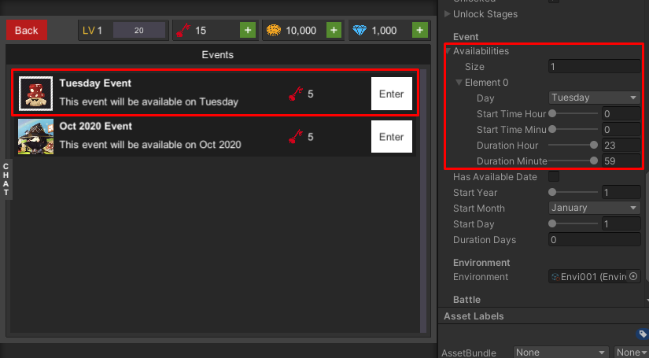
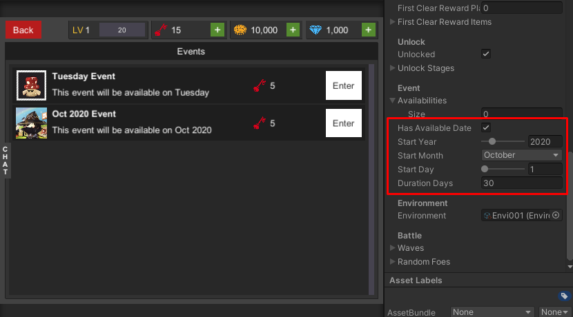
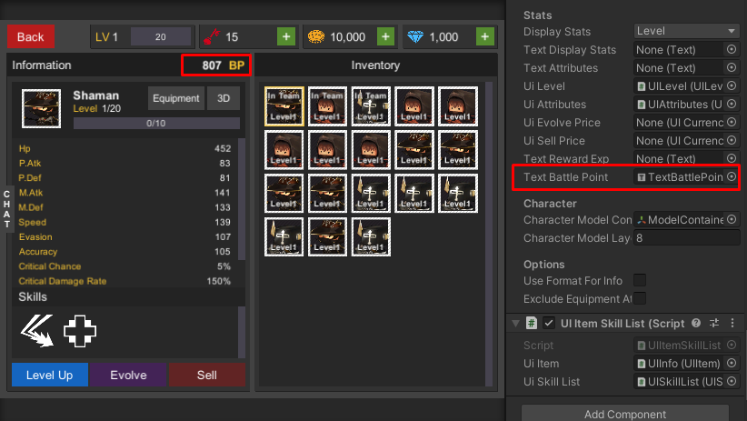
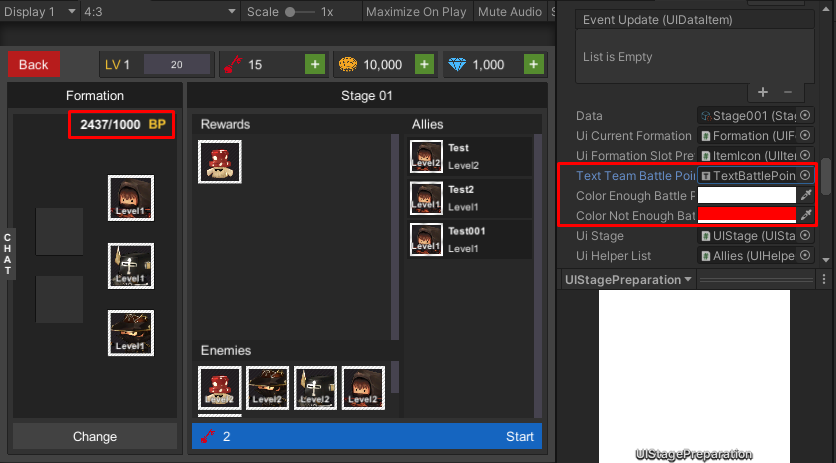

## 1.16b (2021-02-18)
- Make it able to donate for clan more than 1 time per day.
- Add custom currencies rewarding settings to stage, clan check-in and clan donation.

## 1.16 (2021-02-15)
- Add clan chat channel.
- Add clan level/exp.
- Add clan check-in.
- Add clan donation.

**If you uses RPG PHP Service, don't forget to update to 1.16**

## 1.15c (2021-01-08)
- Implement language manager functions.
- Fix demo's character UI's data not set in equipment management UI.

## 1.15b (2021-01-07)
- Fix wrong web-service methods.
- Fix equipment model not working.
- Fix characters not move to formation's position when enter battle.
- Add `sendActionTargetViaRequestQuery` setting to `WebServiceClient`. Use it to call service's function by request query, so path like: `http://hostname/actionName` will be called as `http://hostname?action=actionName` instead, this is good for users who have problem with `.htaccess` settings or `Nginx` settings. Developer also have to set service's `use_request_query_action` to `TRUE`.
- Add load scene async events to `GameInstance`, there are `onLoadSceneStart`, `onLoadSceneProgress` and `onLoadSceneFinish`.

*I am working on adding new clan features and raid boss, please wait :)*

## 1.15 (2020-10-06)
- Add `tag` setting to `BaseGameData` can use it for list filtering (Just implemented to `BaseUIStageList` for now).
- Add `unloked` setting to `BaseStage`, stages which this value is `TRUE` will allowed to enter although the stage not unloked (by clear other stages).
- Add `availablilities` settings to `BaseStage`, developer can set stage to be available within which day of week and time, can uses it to create an events stages which can enter some days of week.

- Add available date settings to `BaseStage`, developer can set stage to be available from date to another date, can uses it to create an events stages which can enter within weeks or months.

- Add `BaseUIStageList` and implemented as `UIStageList` component, use it to show list of stages

- Add stamina refilling, you can changes refill prices in `GameDatabase`'s stamina settings. And also add `UIRefillStamina` which you can set which type of stamina to view refilling info and set event to button to refill.
- Add battle point calculation function to `BaseGameplayRule` (`GetBattlePoint()` function), developer can override `BaseGameplayRule` class and override `GetBattlePoint()` function to changes how to calculate battle point. Also add `textBattlePoint` to `UIItem` it will show battle point which will get from player's item data.

- Add `recommendBattlePoint` setting to `BaseStage` game data, it will be shown in `BaseUIStage` (`textRecommendBattlePoint` text).
- Add `textTeamBattlePointPerRecommend` text component reference to `BaseUIStagePreparation` to show team battle point / stage's recommend battle point in the text component.

- Add `DeadAlly` to `SkillUsageScope`, skills which `usageScope` is `DeadAlly` will able to use on dead character may set `usageScope` to `DeadAlly` for revive character skills.
- Add `reviveCharacter` to `Skill`, if this is `TRUE` it will revive dead character (Character HP will be 1, use buffs to increase HP) when use it on selected dead character.
- Add `equipModelContainers` to `BaseCharacterEntity`, developer can set `Transform` for equipment item model and its `Slot Id`. Then when equipping item it will instantiate equipment item model which has the same `Slot Id` to the `Transform`.
- Add `equipModelPrefabs` to `EquipmentItem`, developer can set `Model Prefab` and `Slot Id` to be instantiated to character entity's equipment item model containers.

**If you uses RPG PHP Service, don't forget to update to 1.15**

## 1.13 (2020-07-29)
- Add chat system.
- Add craft system.
- GameSpark integration is deprecated, use PHP Web-service instead.

## 1.12c (2020-05-04)
- Fix invalid character stats calculation while attacking/defending.
- Add Round time trip calculation to base game service.

## 1.12b (2020-04-15)
- Fix null reference which occurring in clan UIs/user UIs.

## 1.12 (2020-03-27)
- Add material item, the item which is stackable, it's material for character / equipment level-up
- Apply nerf after attacked, buff will be applied before attack
- Add blood steal attributes: (`BloodStealRateByPAtk` and `BloodStealRateByMAtk`)
- Add find user to add friend UI
- Add pending friend request UI
- Add clan system. Player can create clan, request to join clan, accept join request, expel member from clan, exit clan, terminate clan, promote member to manager(which can accept join request), demote manager to member, promote member to clan owner. Now it works with PHP serveice only, don't forget to run `sql-importer.php?update=1.12` to update
- Add clan find UI
- Add clan create UI
- Add pending clan request UI
- Add clan member list UI
- Add clan request list UI

## 1.11c (2020-02-26)
- Fix randomed attributes not save/load while running with LiteDB/SQLite game service

## 1.11b
- Add passive skills

## 1.11
- Add `InGamePackage`, it's selling item while developer can use it to make soft currency package which can buy by hard currency.
- Add randomize attributes system, can random character/equipment attributes.
- For developers who use PHP web service, you have to update source codes, database structure and also have to re-import game data which export from editor.
- For developers who use GameSpark, you have to update source codes and also have to re-import game data which export from editor.

## 1.10b
- Update LiteDB, SQLite Plugins, developers also have to remove `System.Data.dll` from assets
- Fix stunning characters turn count not updates
- Fix invalid JSON export format

## 1.10
- Add first clear rewards
- Add achievement system. Have to updates, for `Gamespark`, have to add new game data: `playerAchievement` with following indexes: id (string), playerId (string), dataId (string), timestamp (Number). For `PHP Service`, download latest version from `https://github.com/insthync/rpg-php-service/releases`, then browse `{{service url}}/sql-importer.php?update=1.10`.
- Implement buff's clear buffs
- Implement buff's clear nerfs
- Implement buff's stun

## 1.09
- Add lootbox animation scene, developer may use it to show summon animation
- Add debug option to `Web Service Client` to show web-service result in console log
- Implement gameplay rule class, developer can extends `Base Gameplay Rule` class to change damage, critical rate, block rate calculation formula. And can change gameplay rule at `Game Instance`

## 1.08e
- Fix invalid asmdef location that causes an error when build

## 1.08d
- Fix no selection in Create Scriptable Object window

## 1.08c
- Add sample of character level up animation scene
- Add sample of character evlove animation scene
- Can see 3D character model via character codex UI

## 1.08b
- Fix some UIs not able to access
- Fix invalid select arena formation
- Show increasing exp characters when win the battle

## 1.08
- Add critical, block attributes to character
- Add resistance attribute to character / equipment / skill buff, this is chance to prevent application of a nerf effect
- Add codex which you can see unlock character / equipment here

## 1.07c
- Fix invalid script filename
- Fix invalid arena formation
- Remove `NO_MAGIC_STATS;NO_EVADE_STATS` from `Scripting Define Symbol`

## 1.07b
- Fix invalid stamina calculation issues
- Add web-service client

## 1.07
- Add arena system, with ranking and rank-up rewards

## 1.06b
- Fix invalid predefine conditions

## 1.06
- In-App purchasing, players can receive hard currency (GEM) from IAP packages
- Show stamina restore count down
- Fix environment object instantiates too many time at initializing state
- Fix invalid stats calculation
- Fix character scale forced to be 1

## 1.05
- Add Social System, you can choose helper guy to help you in battle
- Can send friend request
- Can accept / decline friends
- Can delete friends

## 1.04
- Add SQLite Game Service, I decided to add it to make local database works on iOS devices so customer should use SQLite Game Service instead of LiteDB Game Service

## 1.03
- Remove obsolete fields
- Improve editor for more ease of use
- Add new way to set animation data by clip instead

## 1.02
- Multiple loot box
- Add miss combat text
- Bugs fixes
- Gamesparks integration (<a href="https://medium.com/suriyun-production/turnbase-rpg-template-gamesparks-integration-8a8838984d99">Guide</a>)

## 1.01
- Add equipment system
- Add loot box system
