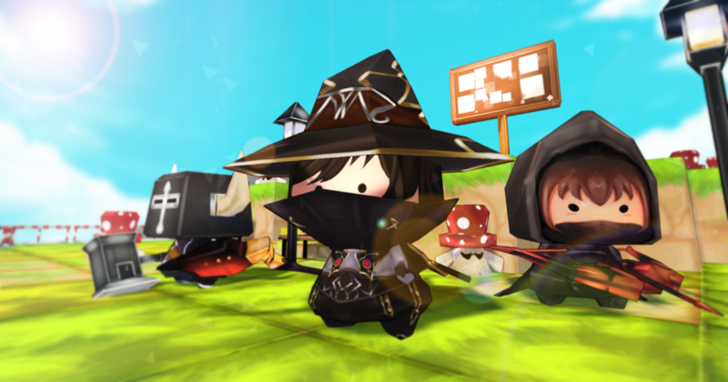
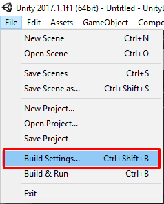
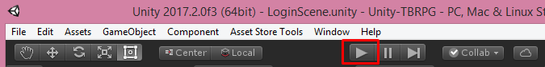
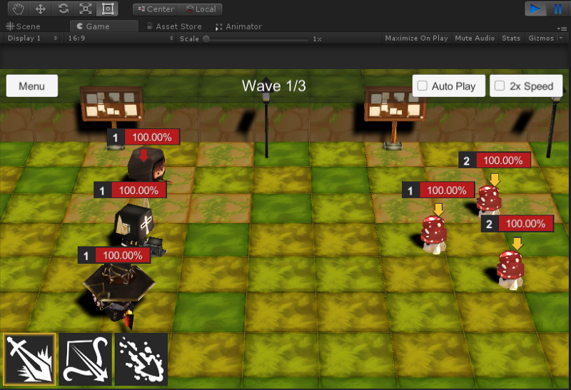

* * *

This is the guide for Turnbase RPG game template which selling at Unity Asset Store ([https://www.assetstore.unity3d.com/#!/content/107578?aid=1100lGeN](https://www.assetstore.unity3d.com/#!/content/107578?aid=1100lGeN))

After imported the package, then we’re going to test the demo, click menu **File -> Build Settings**

Then drag **LoginScene**, **ManageScene** and **BattleScene** from **/Assets/RPGGame/Demo/Scenes** to add them in **Scenes In Build** section

Then you can try by press play button in the editor

