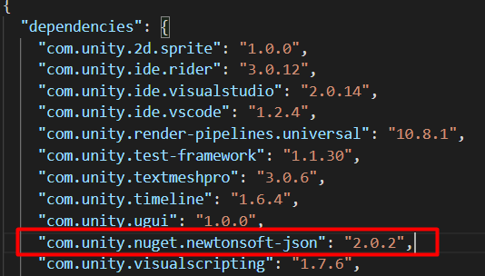

# Getting Started

After imported the package, then we’re going to test the demo, click menu **File -> Build Settings**


Then drag **LoginScene**, **ManageScene** and **BattleScene** from **/Assets/RPGGame/Demo/Scenes** to add them in **Scenes In Build** section.

*You will see `LoginScene`, `LoginSceneSQLite` and `LoginSceneWebService` their different is using game-service, you can find more info [here](pages/017-game-service)*

* * *

Go to your project folder then `/Packages` edit `manifest.json`, Add
```
 "com.unity.nuget.newtonsoft-json": "2.0.2"
```
Into dependencies



* * *

Then set **Scripting Runtime Version** to **.NET 4.x Equivalent** and **Api Compatibility Level** to **.NET 4.x**

Click menu Edit → Project Settings → Player


Then set **Scripting Runtime Version** to **.NET 4.x Equivalent** and **Api Compatibility Level** to **.NET 4.x**


If there is no **.NET 4.x** choice in **Api Compatibility Level**, you should try to close the editor and reopen the project again

* * *

Then you can try by press play button in the editor


