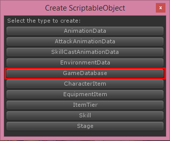

# Game Database

Game database is important part, we’ll use it to collect an game data such as characters, items, stages, rewards

I’ve prepared the demo game database so might not want to create new game database but if you want, You can create new game database by right click on **Project** tab then choose **Create -> ScriptableObject (TurnbaseRPG)**

Then choose **GameDatabase**

Then new game database will be created

Then set game database in **GameInstance** which located in **LoginScene**

In game database you can set following configs:

*   **Player Max Level** this is max level of player (not the characters or items)
*   **Player Exp Table** require exp for level up from level 1 to **Player Max Level** with growth factor
*   **Soft Currency** this is currency which we will use it to Upgrade, Evolve items can receive by clear stage, sell items, you can set its **Icon** and **Start Amount** (Amount when start game)
*   **Hard Currency** this is currency which we will use it to random item from loot box, revive characters, you can set its **Icon** and **Start Amount** (Amount when start game)
*   **Stage Stamina** this is required stamina to start battle, you can set its **Icon**, max amount from level 1 to **Player Max Level** with growth factor in **Max Amount Table, Recover Unit** and **Recover Duration**
*   **Stage Formations** this is list of formation and its info
*   **Items** this is list of all items, see more info at **Item** section
*   **Stages** this is list of all stages, see more info at **Stage** section
*   **Start Items** this is list of items that player will receives at beginning of the game
*   **Start Characters** this is list of characters that player will receives at beginning of the game and will be set to the formation
*   **Unlock Stages** this is list of stages that will be unlocked at beginning of the game, you should first stage here
*   **Character Base Attributes**, this is base attributes for all characters, this will be sum with calculated character’s attributes
*   **Revive Price**, required hard currency to revive all characters
*   **Min Atk Vary Rate**, **Max Atk Vary Rate** are Rate that will be random by min and max value to multiply with attack damage
*   **Reset Item After Evolve**, if this is True item level will be reset to 1 after evolve