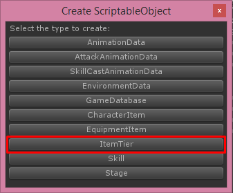
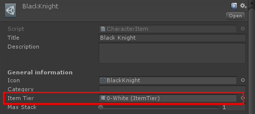

* * *

This is the guide for Turnbase RPG game template which selling at Unity Asset Store ([https://www.assetstore.unity3d.com/#!/content/107578?aid=1100lGeN](https://www.assetstore.unity3d.com/#!/content/107578?aid=1100lGeN))

**Item**

There are many type of items such as Character, Equipment, Junk but for every items there are following configs

*   **Title**, item’s title/name
*   **Description**, item’s description
*   **Icon**, item’s icon
*   **Item Tier**, item’s tier see more at **Item Tier** section
*   **Max Stack**, item’s max stack in inventory

* * *

**Item Tier**

All items data required item tier, You can create new item tier by right click on **Project** tab then choose **Create -> ScriptableObject**

Then choose **Item Tier**

Then new item tier will be created, you must set its name to be unique (Not be the same as another item tier)

Then after you set data for item tier, you can set item tier to your item as you wish

Each item tier there are following configs

*   **Title**, tier’s title/name
*   **Description**, tier’s description
*   **Icon**, tier’s icon
*   **Max Level**, item’s max level
*   **Exp Table**, requires exp for level up from level 1 to **Max Level** with growth factor
*   **Sell Price Table**, sell price from level 1 to **Max Level** with growth factor
*   **Level Up Price Table**, level up price from level 1 to **Max Level** with growth factor
*   **Reward Exp Table**, amount of exp that will be given to level up item when use this item as level up material
*   **Evolve Price**, price to evolve

* * *

**Item Attributes**

For an Character and Equipment their are an attributes that will be calculated for character battle purposes there are

*   **Hp**, hit point/health point, character will dies when this value <= 0
*   **PAtk**, Physical Attack, this will minus to **pDef** to calculate damage
*   **PDef**, Physical Defend, **pAtk** will minus to this to calculate damage
*   **MAtk**, Magical Attack, this will minus to **mDef** to calculate damage
*   **MDef**, Magical Defend, **mAtk** will minus to this to calculate damage
*   **Spd**, Speed, character with higher speed will have more chance to attack
*   **Eva**, Evasion, character with higher evasion will have more chance to avoid damage from character with lower accuracy
*   **Acc**, Accuracy, Character with higher accuracy will have more chance to take damage to character with lower evasion

When character attacks, damage will calculated by

*   pDamage = a.pAtk — b.pDef, if this is less than 0 it will equals to 0
*   mDamage = a.mAtk — b.mDef, if this is less than 0 it will equals to 0
*   totalDamage = (pDamage + mDamage) \* (Random between minAtkVaryRate and maxAtkVaryRate)
*   If critical occurs, totalDamage = totalDamage \* critDamageRate
*   If block occurs, totalDamage = totalDamage / blockDamageRate
*   Evade chance = (Acc — Eva) / Acc, if character can evade character won’t receive damages