# How to add Character

**Character**

Character is one of item, to create new character you have to do following steps

*   Prepare **Character Entity** with its animations, **Character Entity** is will be instantiated in manage and battle scene to show up how character’s appearance is and its movement
*   Prepare **Character Item** with its data (Item Tier, Attributes, Skills, Evolve Requirements, Character Entity), You can set Skills, Evolve Requirements for **Character Item** later but it’s required **Character Entity** so that is why we should prepare **Character Entity** first
*   Add **Character Item** to **Items** field in **Game Database**

* * *

**Prepare Character Entity**

To prepare character entity you should create new empty scene (from menu **File -> New Scene**) for easily to manage character model and its animation

Then drag you character mesh from **Project** tab to the scene

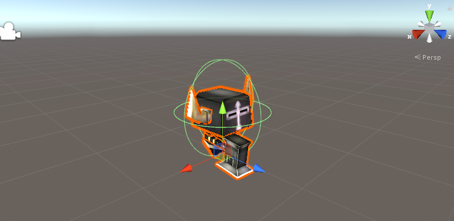

Then add **Character Entity** component

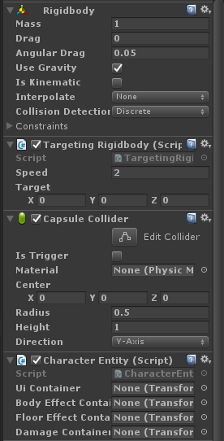

Then adjust your Capsule Collider, it should fit to character model

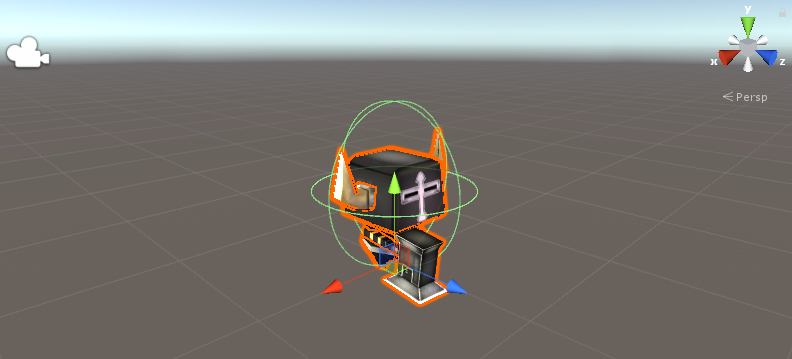

Then set an element container there are:

*   **Ui Container**, the transform which will instantiates an UI element into it if you want to show an Hp, Buff icons above your character you may set transform to be above the character

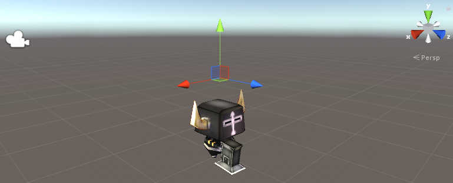

*   **Body Effect Container**, the transform which will instantiates an effects such as hit effects, cast effect that will be appeared on the character

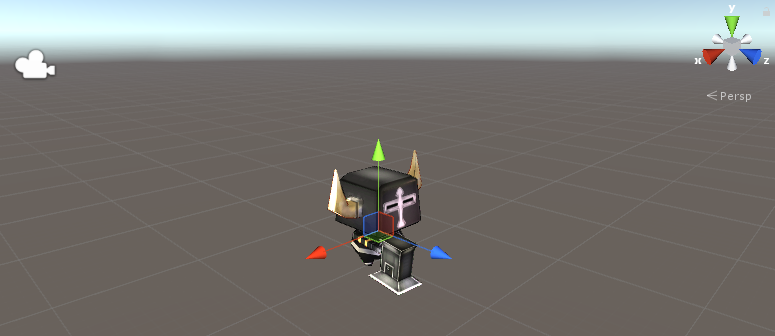

*   **Floor Effect Container**, the transform which will instantiates an effects such as hit effects, cast effect that will be appeared below the character

*   **Damage Container**, the transform which will instantiates an damages such as arrow, fireball it should be on front of character

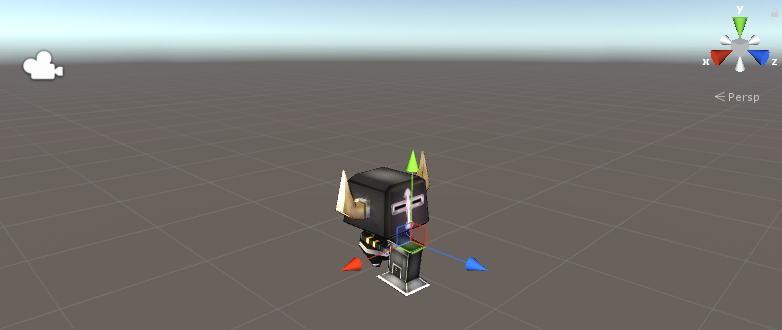

All container should be the child of the character entity so after you setup all container transform you should place them inside the character entity

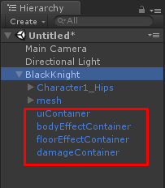

Then set them to the Character Entity component

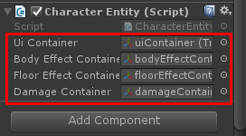

After finish an containers setup then you have to set animator controller, I’ve prepared the Demo’s animator controller which located at **/Assets/RPGGame/Demo/Animation/Character** its name is **CharacterAnimatorController** you may duplicate it as your own (Press Ctrl+d) then drag it to **Animator** component which attached to your **Character Entity**

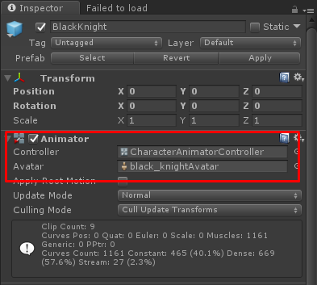

Then make your **Character Entity** as **Prefab** by drag it to **Project** tab

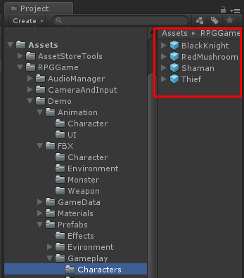

* * *

**Character Animator Controller in Depth**

An Animator Controller for the Character Entity is required following parameters:

*   **Speed (Float)**, parameter for move speed if character is moving speed will be greater than 0 so you can make transition by speed condition so you should set **Animation Clip** to the **State** which will play move animation with transition condition: **Speed** greater than 0
*   **IsDead (Boolean)**, parameter to play dead animation when character dead so you should set **Animation Clip** to the **State** which will play dead animation with transition condition: **IsDead** is **True**
*   **ActionState (Integer)**, parameter to play attack, cast skills animations which receives from **Animation Data**’s  field named **Animation Action State** so you should set **Animation Clip** to the **State** which will play attack, cast skills animations with transition condition: **ActionState** equals to the number that set at **Animation Data -> Animation Action State** see more at **Attack Animation** and **Skill Cast Animation** section
*   **Hurt (Trigger)**, parameter to play hurt animation when character attacked

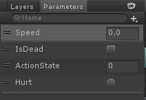

You can see Demo’s **CharacterAnimatorController** which located at **/Assets/RPGGame/Demo/Animation/Character**

* * *

**Character Item**

Character Item is extended from Item with more configs there are

*   **Attack Animation**, animation data to play attack animation see more at **Attack Animation** section
*   **Skills**, skills that can use by the character
*   **Model**, this will placed by **Character Entity,** which is will be instantiated in manage and battle scene to show up how character’s appearance is and its movement
*   **Evolve Info**, an required evolve materials and target item which will be evolving to will be set here

You can create new character item by right click on **Project** tab then choose **Create -> ScriptableObject**

Then choose **Character Item**

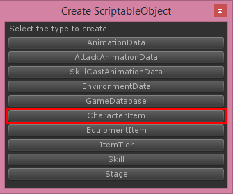

Then new character item will be created, you must set its name to be unique (Not be the same as another items includes another types items)

Then add it to your **Game Database**

