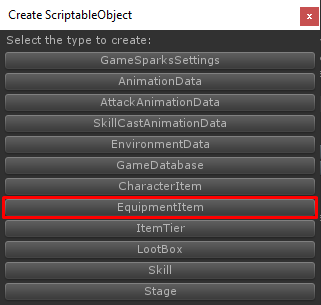

# How to add Equipment

Equipment Item is extended from Item with more configs there are

*   **Extra Attributes**, these extra attributes will not increase when item level up
*   **Equippable Positions**, positions that this item can be equipped
*   **Evolve Info**, an required evolve materials and target item which will be evolving to will be set here

You can create new equipment item by right click on **Project** tab then choose **Create -> ScriptableObject (TurnbaseRPG)**

Then choose **Equipment Item**

Then new equipment item will be created, you must set its name to be unique (Not be the same as another items includes another types items)

Then add it to your **Game Database**

