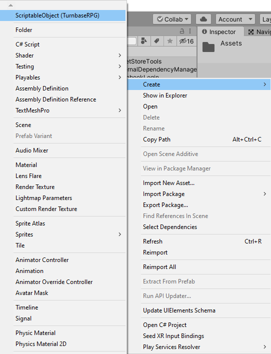
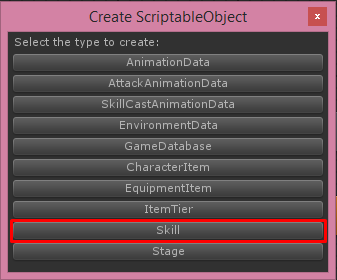

# Skill

An characters can have skills, skill can be buff skill, nerf skill, attack skill or may mix all of them as you wish

You can create new skill by right click on **Project** tab then choose **Create -> ScriptableObject (TurnbaseRPG)**

Then choose **Skill**

Then new skill will be created, you must set its name to be unique (Not be the same as another skills)

Each skill there are following configs

*   **Title**, skill’s title/name
*   **Description**, skill’s description
*   **Icon**, skill’s icon
*   **Usage Scope**, target scope that play can choose to apply the skill
*   **Cool Down Turns**, amount of turns that skill will be ready again after used
*   **Attacks**, an attack data each attack you can set **Attack Scope**, scope of target that will receive damage. **Attack Animation** animation data when attacking see more at **Attack Animation** section. **Attack Damage** the damage when use skill will equals to \`a.fixDamage\` + ((\`a.pAtkDamageRate\` \* \`a.pAtk\`) — \`b.pDef\`) + ((\`a.mAtkDamageRate\` \* \`a.mAtk\`) — \`b.mDef\`) when a is attacker and b is the guy whom receive damage.
*   **Buffs**, an buff data each buff you can set **Buff Scope**, scope of target that will receive buff. **Icon**, icon which will appears when buff applied. **Buff Effects**, effects that will instantiates when buff applied. **Type**, type of buff. **Apply Chance**, chance that buff will be applied. **Apply Turns**, how many turns that buff will be applied. **Clear Buffs**, amount of buffs that will be cleared randomly. **Clear Nerfs**, amount of nerfs that will be cleared randomly. **Is Stun** if this is **True** character whom this buff applied to will stun. **Attributes** buff attributes for nerfs it should be lower than zero. **P Atk Heal Rate** amount of skill user’s P Atk multiplier to heal to character which buff applied to. **M Atk Heal Rate** amount of skill user’s M Atk multiplier to heal to character which buff applied to.
*   **Cast Animation**, animation data when casting skill see more at **Skill Cast Animation** section