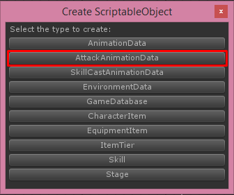
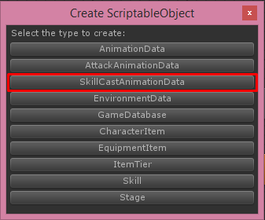
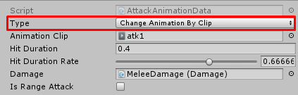
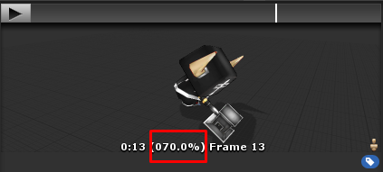
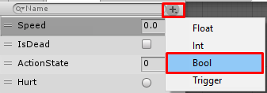
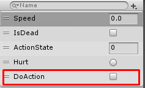
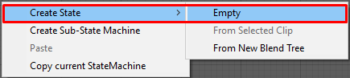
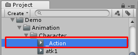
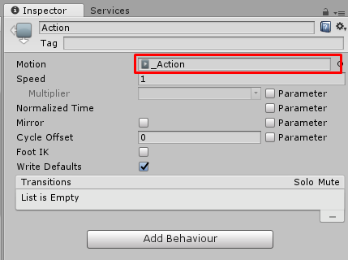

# Attack Animation and Skill Cast Animation

**Attack Animation**

An characters required Attack Animation, for an skills if the skill can attack it must set Attack Animation, You can create new attack animation by right click on **Project** tab then choose **Create -> ScriptableObject (TurnbaseRPG)**

Then choose **Attack Animation Data**

Then new attack animation will be created

Each attack animation there are following configs

*   **Animation Action State**, the number for Character Animator Controller’s **Action State** condition
*   **Animation Duration**, total duration of animation
*   **Hit Duration**, duration to instantiates damages while playing animation
*   **Is Range Attack**, if this is **True** character will not move to front of target to attack
*   **Damage**, damage effects with how it appear/move in the game see more at Damage section

* * *

**Skill Cast Animation**

An skills required Cast Animation, You can create new attack animation by right click on **Project** tab then choose **Create -> ScriptableObject (TurnbaseRPG)**

Then choose **Skill Cast Animation Data**

Then new skill cast animation will be created

Each skill cast animation there are following configs

*   **Animation Action State**, the number for Character Animator Controller’s **Action State** condition
*   **Animation Duration**, total duration of animation
*   **Cast At Map Center**, if this is **True** character will move to map center to cast skill
*   **Cast Effects**, effects that will instantiates when casting skill

* * *

### Version 1.03 or above

Version 1.03 or above will have new option to set Animation Data by using animation clip so you will not have to set **Animation Action State**, **Animation Duration** and also not have to create new state in animator controller. Just set the **Animation Clip** and **Hit Duration Rate**

New Type field

**Hit Duration** will be deprecated, we will use **Hit Duration Rate** instead, you can get value of **Hit Duration Rate** from animation clip

We can preview animation clip to see when it should hit enemy, in this example it is 70%, so we’re going to set **Hit Duration Rate** to 0.7

For old users who have modifies Demo’s animator controller you have to

*   Add **DoAction** parameter as Bool

*   Create new state with any name, then create new **Animation** with name **\_Action** then set into it

In animator controller create new state

Then go to Project, create new Animation

You must set it name to \_Action

Then set it to your created state

*   Then you have to set transition to this state from any state with condition **DoAction** equal to **True** and set transition from this state to idle state with condition **DoAction** equal to **False**