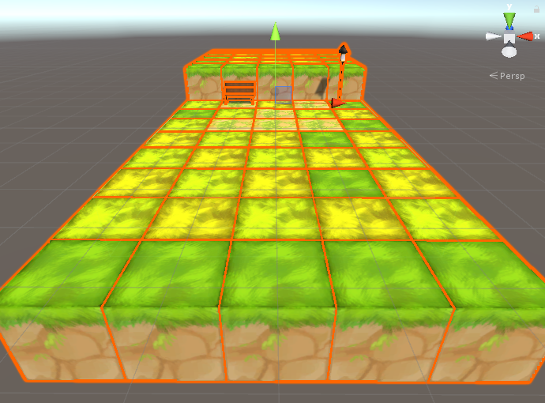
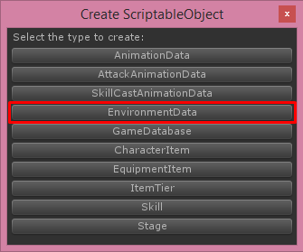
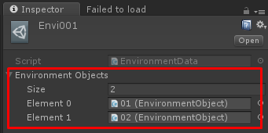

# Environment Data

Environment data will store an **Environment Object** which will appears in Battle scene as background environment it will be set to **Stage** to determine how stage’s environment will be

Before create environment data you should prepare an environment objects

To create **Environment Object** you just create empty gameobject then add **Environment Object** component

You have to create the environment then add it as children of **Environment Object** then adjust collider to fit with the environment and make it as prefab

Then create environment data, You can create environment data by right click on **Project** tab then choose **Create -> ScriptableObject**

Then choose **Environment Data**

Then new environment data will be created

Then add an environment objects to field **Environment Objects**

