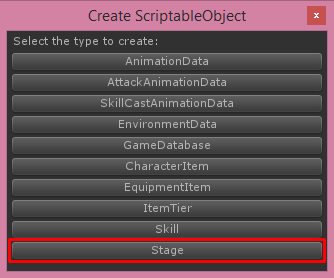
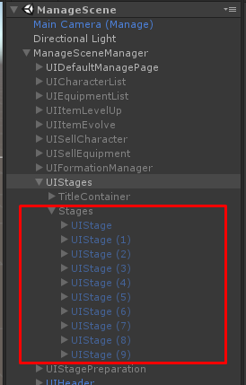

# Stage

You can create stage by right click on **Project** tab then choose **Create -> ScriptableObject (TurnbaseRPG)**

Then choose **Stage**

Then new stage will be created, you must set its name to be unique (Not be the same as another stages)

Each stage there are following configs

*   **Title**, stage's title/name
*   **Description**, stage's description
*   **Tag**, stage's tag, it will be used for filtering in `UIStageList`
*   **Stage Number**, the display number which you show on UI
*   **Icon**, stage's icon
*   **Environment**, environment that will be appears while playing in battle scene
*   **Waves**, its length will be amount of waves when playing the stage each wave you can set: **Use Random Foes**, if this is **True** this will use foes data from **Random Foes**. **Foes**, Foe character with its level.
*   **Random Foes**, Randoming foes for every waves when the wave is use random foes
*   **Require Stamina**, require stamina to start playing the stage
*   **Random Custom Currencies**, randoming rewarding custom currencies
*   **Random Soft Currency Min Amount** and **Random Soft Currency Max Amount**, rewarding soft currency will random by min value to max
*   **Reward Player Exp**, Amount of exp that player will receive when clear the stage
*   **Reward Character Exp**, Amount of exp that character will receive when clear the stage
*   **Reward Items**, item that player can receive when clear the stage
*   **First Clear Reward Custom Currencies**, rewarding custom currencies which will be given to players when clear this stage first time.
*   **First Clear Reward Soft Currency**, rewarding soft currency which will be given to players when clear this stage first time.
*   **First Clear Reward Hard Currency**, rewarding hard currency which will be given to players when clear this stage first time.
*   **First Clear Reward Player Exp**, rewarding player EXP which will be given to players when clear this stage first time. 
*   **First Clear Reward Items**, rewarding items which will be given to players when clear this stage first time.
*   **Unlocked**, if this value is **True** this stage will be allowed to enter although it does not unlocked by clear other stages
*   **Unlock Stages**, stages that will be unlocked after clear the stage
*   **Availabilities**, available day of week and time for this stage, player can enter available stages only. If this list is empty it will available every day and time.
*   **Has Available Date**, if this is **True** it will uses **Start Year**, **Start Month**, **Start Day** and **Duration Days** to set stage availability.

After prepare the stage you have to set it to stage selection UI to make it available to select at **ManageScene** which located at **/Assets/RPGGame/Demo/Scenes**

For the example **ManageScene** you can see how to add stage UI in **ManageSceneManager/UIStages/Stages**

