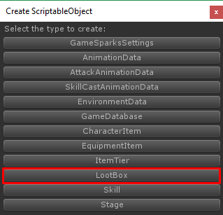
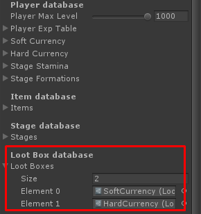

# Loot Box

You can create loot box data by right click on **Project** tab then choose **Create -> ScriptableObject**

Then choose **LootBox**

Then new loot box will be created, you must set its name to be unique (Not be the same as another loot boxes)

Each loot box there are following configs

*   **Title**, loot box’s title/name
*   **Description**, loot box’s description
*   **Icon**, loot box’s icon
*   **Requirement Type**, type of currency
*   **Requirement Currency Amount**, amount of currency
*   **Lootbox Rewards**, item that player can receive when open the loot box

Then add it to your **Game Database**

