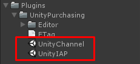
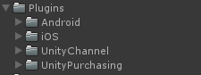
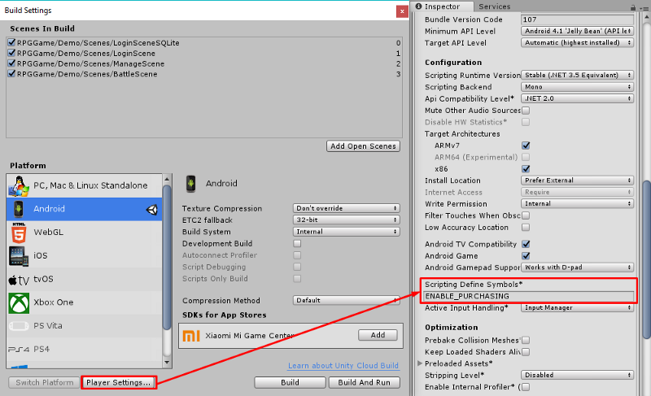
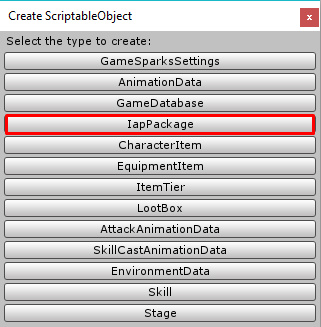
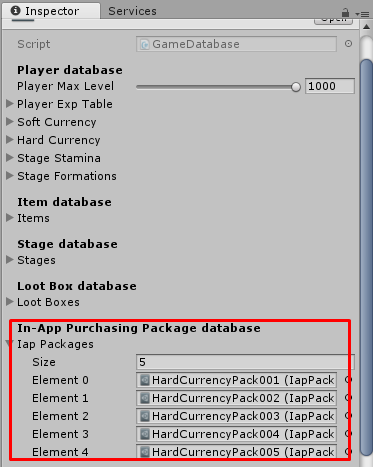

# In-App Purchasing

This template use Unity’s purchasing to integrate In-App Purchasing.

So you have to enable **Unity Purchasing** as following steps via link [https://docs.unity3d.com/Manual/UnityIAPSettingUp.html](https://docs.unity3d.com/Manual/UnityIAPSettingUp.html)

If you enabled **Unity Purchasing** but an error still occur after imports this template package you might have to import these two packages

Import these packages

When all packages already imported, it will contain things like this

* * *

Then you have to add **ENABLE\_PURCHASING** in **Scripting Define Symbols**

* * *

You can create iAP package data by right click on **Project** tab then choose **Create -> ScriptableObject (TurnbaseRPG)**

Then choose **IapPackage**

Then new IAP package will be created, you must set its name to be unique (Not be the same as another IAP package)

Each IAP package there are following configs

*   **Product ID**, it is product ID for in-app product data which you can add in **IAP Catalog**, each entry in catalog contains data that you have set at **Google Play / Apple App Store,** you can learn about **IAP catalog** from [https://docs.unity3d.com/Manual/UnityIAPCodelessIAP.html](https://docs.unity3d.com/Manual/UnityIAPCodelessIAP.html)
*   **Title**, package’s title/name
*   **Description**, package’s description
*   **Icon**, package’s icon
*   **Reward Soft Currency**, amount of soft currency player will receive when buy the package
*   **Reward Hard Currency**, amount of hard currency player will receive when buy the package
*   **Reward Items**, items that player will receive when buy the package

Then add it to your **Game Database**

