# GameSparks Integration

Now we’ve Gamesparks integration, if you want to use Turnbase RPG game template with Gamesparks to keep players data to server, you have to register your Gamesparks account then create your game project in Gamesparks.

To use Gamesparks with your project, for client side, you have to download Gamesparks SDK from [https://docs.gamesparks.com/sdk-center/unity.html](https://docs.gamesparks.com/sdk-center/unity.html) (Download link is on top of the page), After import the package set GameSparks API Key and GameSparks API Secret in Gamesparks settings

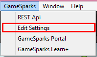

Select to menu: GameSparks -> Edit Settings

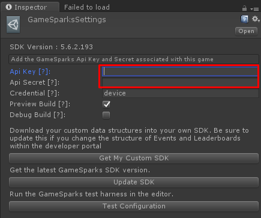

Set Api Key/Secret that can copy from your Dashboard

Then download and import package to your project from [https://github.com/insthync/gamesparks-tbrpg-addons/releases](https://github.com/insthync/gamesparks-tbrpg-addons/releases)

Then in LoginScene remove “Lite Db Game Service” component from “GameInstance” then add “GS Game Service” and “Game Sparks Unity”

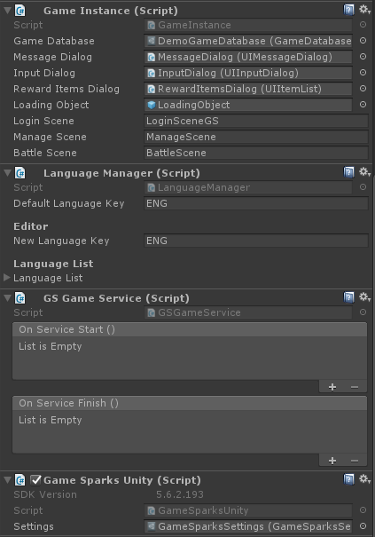

For server side, you have to create currencies to matches with client’s GameDatabase for example, the database have GOLD as soft currency and GEM as hard currency

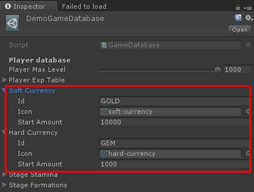

Then you have to create GOLD and GEM currency in Gamesparks

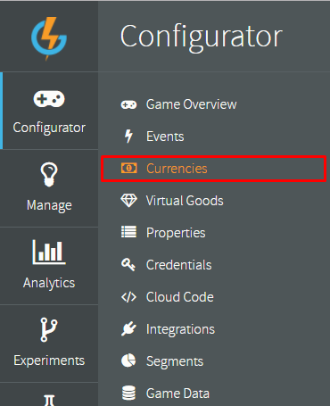

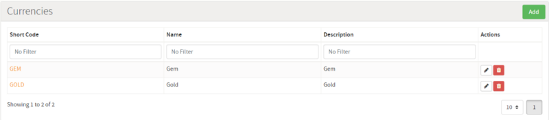

Then create event named “SERVICE\_EVENT” with “TARGET” as String type and “DATA” as JSON type

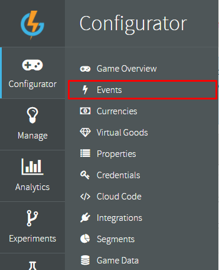

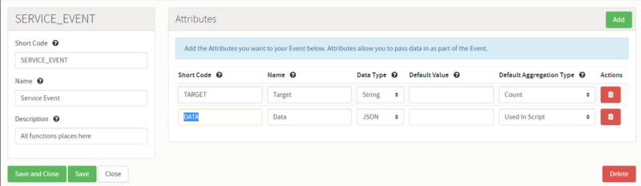

Then download release cloud code from [https://github.com/insthync/CloudCode-GS-TBRPG](https://github.com/insthync/CloudCode-GS-TBRPG) then import it in cloud code section

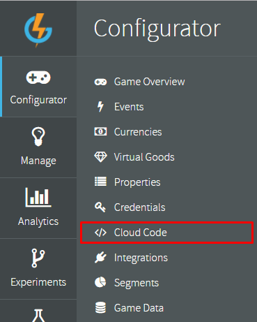

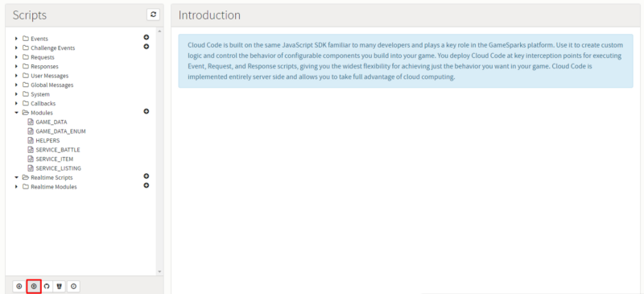

Then when you have changes game content at your client you have to export data via “GS Game Service”’s context menu named “Export Game Database”

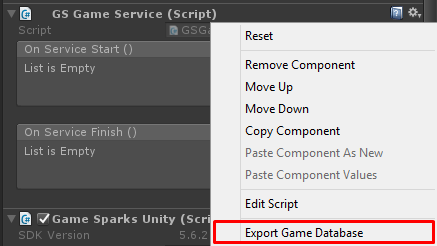

Save it anywhere then open it with Notepad (or another text editor) then copy its content and paste it to Cloud code -> Modules -> GAME\_DATA

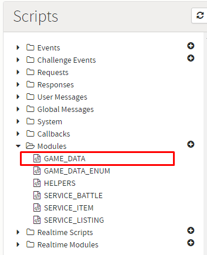

Then replace “game database” content

* * *

Then you have to add **Game Data**

Go to **Configurator -> Game Data**

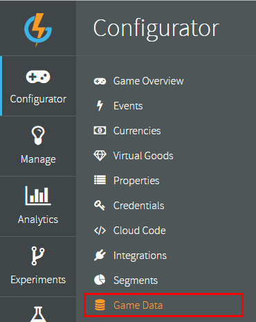

Then add following data with indexes

*   player — with following indexes: id (string)

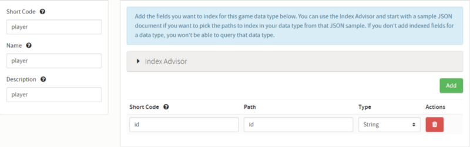

*   playerBattle — with following indexes: dataId (String), id (String), playerId (String), session (String), timestamp (Number)

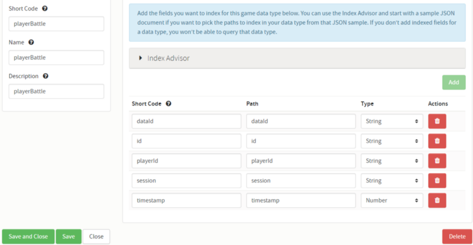

*   playerClearStage — with following indexes: dataId (String), id (String), playerId (String), timestamp (Number)

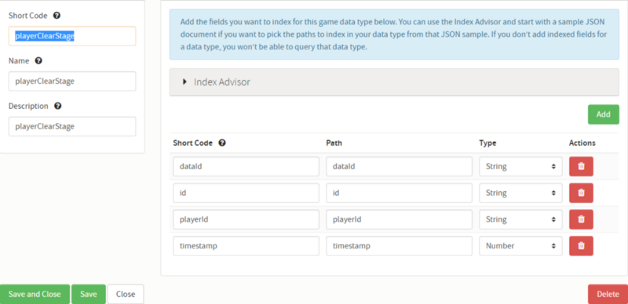

*   playerFormation — with following indexes: dataId (String), id (String), playerId (String), position (String), timestamp (Number)

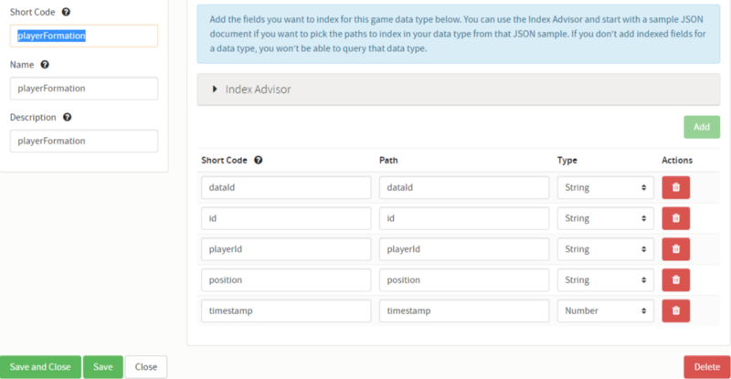

*   playerItem — with following indexes: amount (Number), dataId (String), id (String), playerId (String), timestamp (Number)

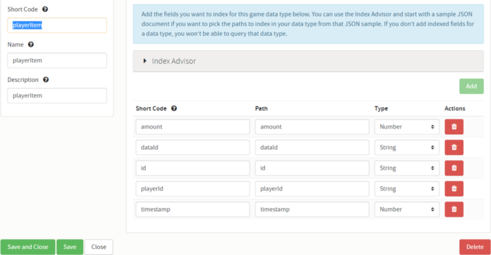

*   playerStamina — with following indexes: dataId (String), id (String), playerId (String), timestamp (Number)

*   playerUnlockItem — with following indexes: dataId (String), id (String), playerId (String), timestamp (Number)

*   playerFriend — with following indexes: id (string), playerId (string), targetPlayerId (string), timestamp (Number)

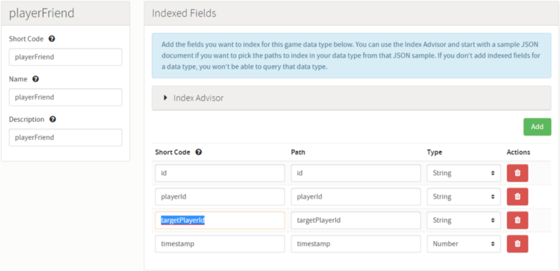

*   playerFriendRequest — with following indexes: id (string), playerId (string), targetPlayerId (string), timestamp (Number)

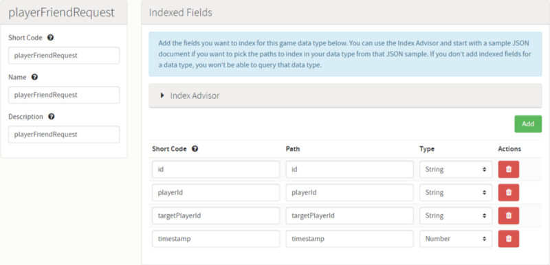

*   playerAchievement — with following indexes: id (string), playerId (string), dataId (string), timestamp (Number)

So you will have data like this

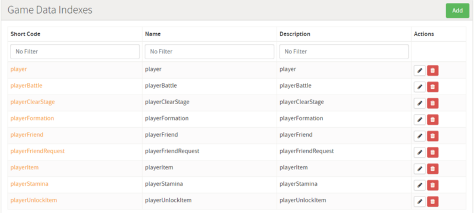

* * *

#### In-App Purchase Integration

From version 1.06 and above, it is already integrated In-App Purchase, but you will have to add integration data for GameSpark.

In your game dashboard, go to **Integrations** menu

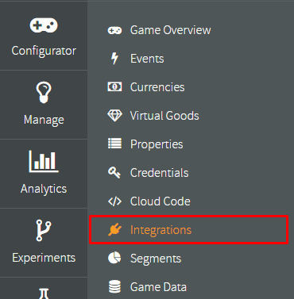

Then set **Google App ID** and **Google Play Public Key**

*   **Google App ID** it is package name which you set in **Build Settings**, eg. com.suriyun.tbrpg
*   **Google Play Public Key**, you can find it in Google Play Console → App Dashboard

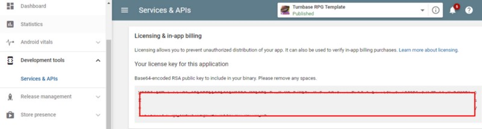

Then set Apple Bundle ID

*   **Apple Bundle ID** it is package name which you set in **Build Settings**, eg. com.suriyun.tbrpg

Then add Virtual Goods, each virtual good you have to set following data:

*   **Short Code**, use **Product ID** which you set in **IapPackage** data

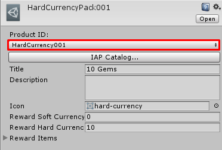

Use this value as short code

*   **Name**
*   **Description**
*   **iOS Product ID**, the product ID which you have set in Apple app store
*   **Google Product ID**, the product ID which you have set in Google Play console

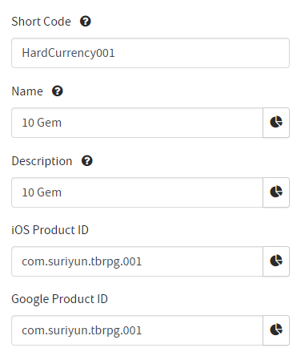

Here is example data that I’ve set for the Demo

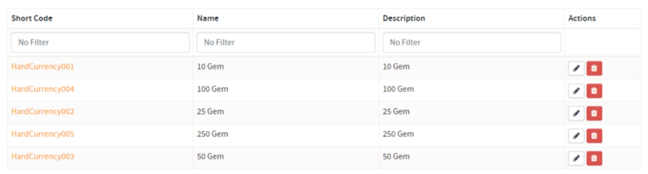