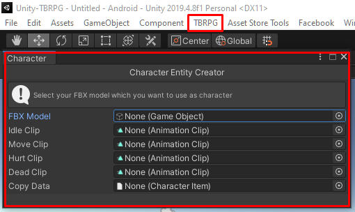
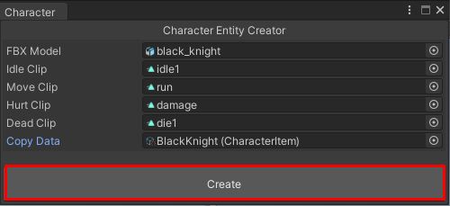
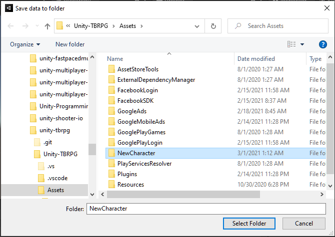
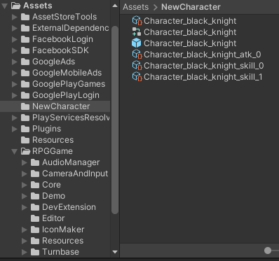

# Character Entity Creator

In package version `1.16c` or above, will have `Character Entity Creator` which can help you to create character entity easier.

You can open `Character Entity Creator` from menu `TBRPG` -> `Create CharacterEntity`.

It is very easy to use, just select FBX model from `Assets` then set following animation clips (Idle, Move, Hurt, Dead) and you can select `Character Item` which you want to copy in `Copy Data` field. And just click create.
*I recommend to choose `Copy Data`, which you can choose data from the Demo because it will duplicate new `Character Item` data, its `Attack Animation Data` and `Skill Data` which will helps you to modify data later*

Then select folder to save files.

After select the folder, files will be saved in the folder.

If you chose `Copy Data` it will duplicate `Character Item`, `Attack Animation Data` and `Skill Data`, then you just select those game data and modify it as you wish. After that, just add `Character Item` data to `Game Database`.

