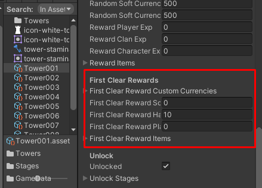
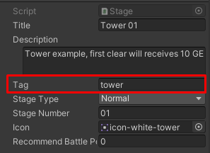
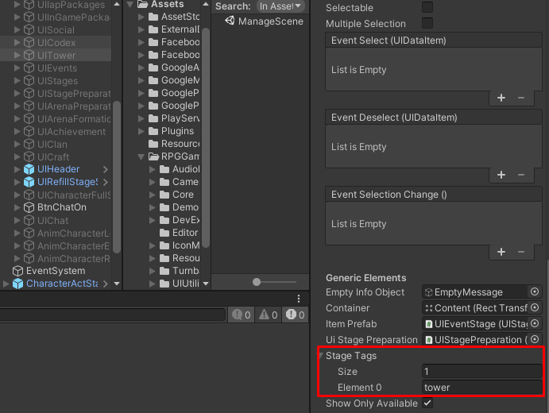

# How Tower Stage Work?

Tower stage data is the same as `Stage` data but it has an `First Clear Rewards` setting

and `Tag`

Then in `ManageScene` -> `ManageSceneManager` -> `UITower` there is a attached component: `UIStageList` which uses `Tag` for listing filtering

