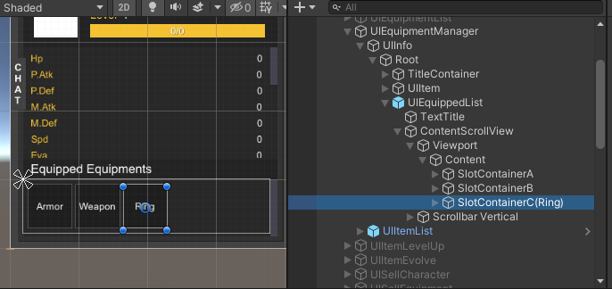
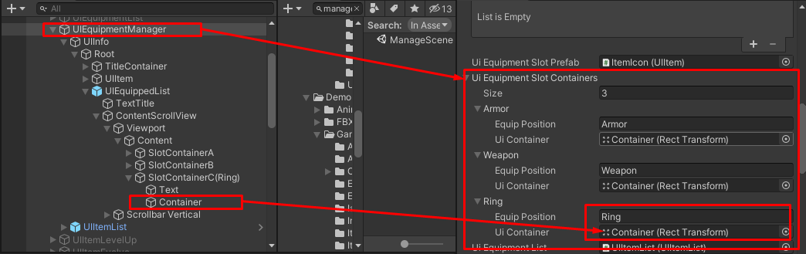

# How to add new equip position

There are 2 parts, UI and game data

For the UI part, you have to create a new container for the equip position

Then set container to the `UIEquipmentManager` component -> `Ui Equipment Slot Containers`, you have to set `Equip Position` for this example I will add `Ring`

Then for the game data part, in `EquipmentItem` game data, just add `Ring` to `Equippable Positions`

That is it.