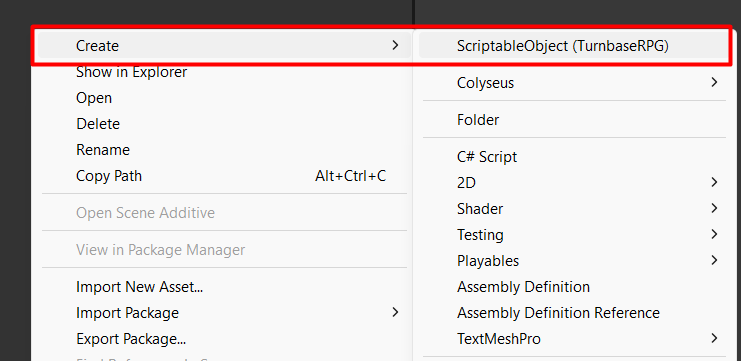
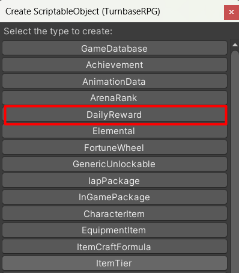
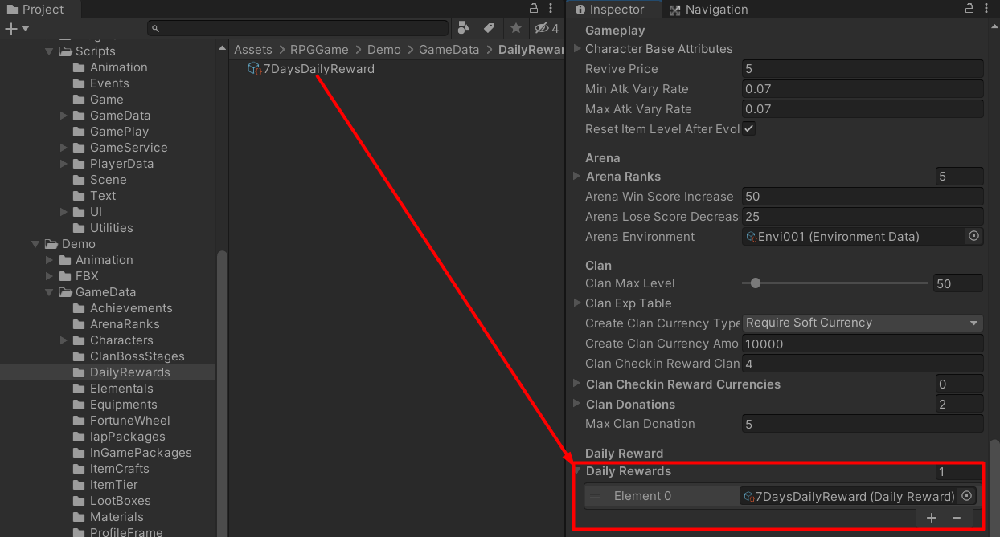
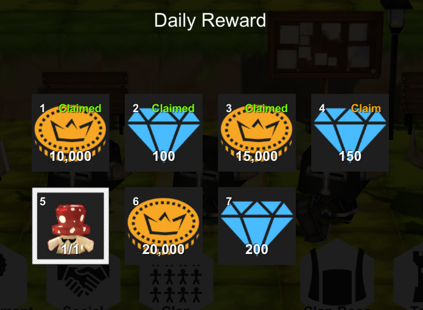
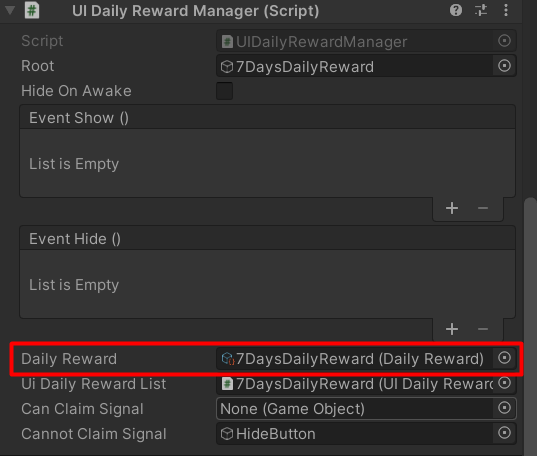

# Daily Rewarding

Daily rewarding is a feature which work with the PHP web-service only, it can have multiple daily reward in the game.

You can create Daily rewarding data by right click in `Project` tab area then select `Create` and `ScriptableObject (TurnbaseRPG)`

Then create window will popped up, choose `DailyReward` to create a daily reward data

In the daily reward data you can set its `Mode`, `Monthly` or `Weekly`, `Weekly` daily rewarding will be started at Sunday.
Then you can set it to `Consecutive` or not, if it is consecutive, player will receive rewards consecutively for example, if player receive reward at 2023-04-06, player will receive first daily reward, then if player receive reward again at 2023-04-08 player will receive second daily reward, no skipping.

After you setup the daily reward data, you have to add it to your game database

And export data to web-service.

## How it work

When you enter the game to manage scene which has instance of `UIAllDailyRewardManager` component which is a component which has list of `UIDailyRewardManager` component, `UIAllDailyRewardManager` will tell instances of `UIDailyRewardManager` to reload reward list and show it.

* * *

The reward list will be loaded based on daily reward data ID, which is bring from daily reward data which will be set in `Daily Reward` field

So, you have to set created daily reward to the UI component (`UIDailyRewardManager`) to make it know the ID and use it to load reward list from web-service.

When reward list loaded, reward entry UIs will be created by `UIDailyRewardList` component by `Item Prefab` and placed into `Container` transform.