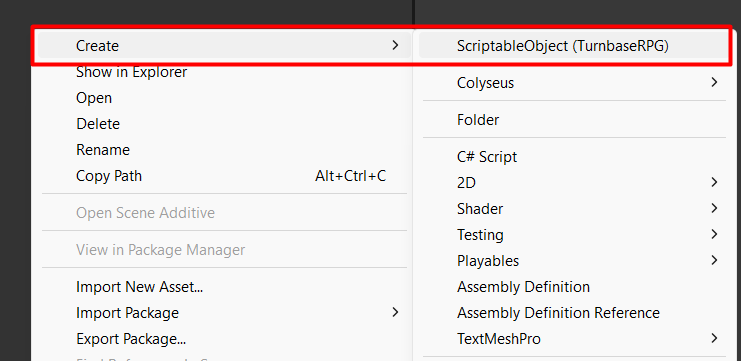
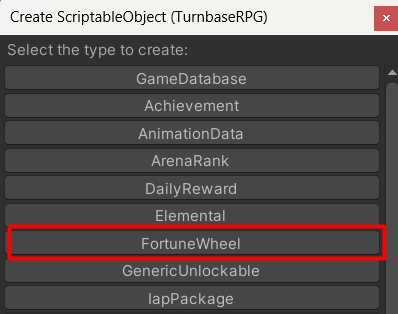
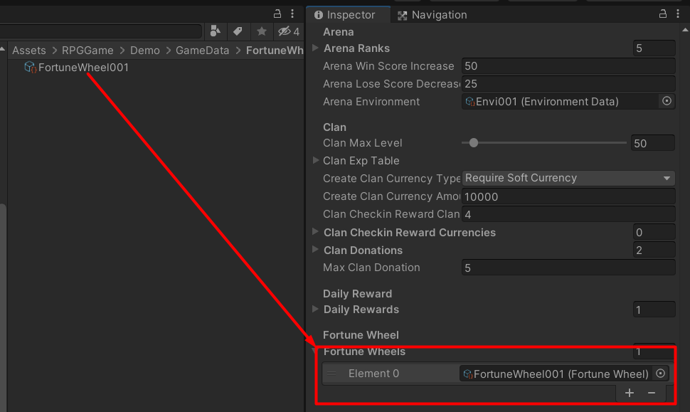
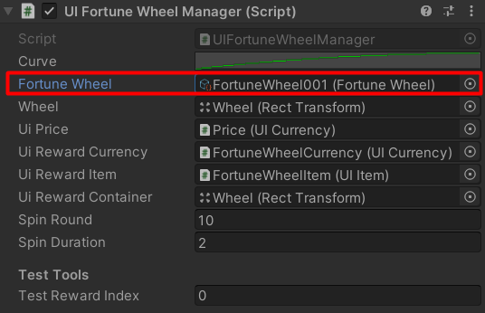

# Fortune Wheel

You can see what it is in this [video](https://www.youtube.com/watch?v=271zIbl7WsM).

You can create a fortune wheel data by right click in `Project` tab area then select `Create` and `ScriptableObject (TurnbaseRPG)`

Then create window will popped up, choose `FortuneWheel` to create a fortune wheel data

You will see `Requirement Type` it is type of currency which required to use fortune wheel, for example if you set `Requirement Type` to `RequireSoftCurrency` and set `Price` to `1000`, when you going to use fortune wheel, you have to pay `1000` amount of soft currency (the demo is GOLD)

Then you can set `Rewards` as you which.

After you setup the fortune wheel data, you have to add it to your game database

And export data to web-service.

## How it work

It has a UI component named `UIFortuneWheelManager` which when it show, it will load fortune wheel data to setup UIs, so you have to set created fortune wheel data to `UIFortuneWheelManager` -> `Fortune Wheel`.

