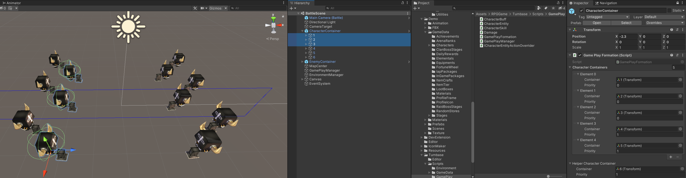
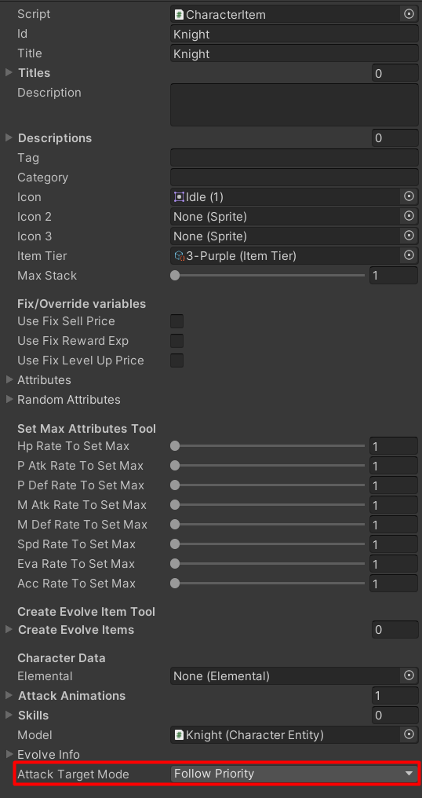
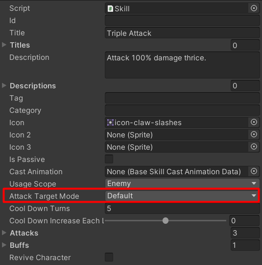

# Formation

Max amount of characters in a formation is actually **NOT** fixed, the max amount in battle scene is `Game Play Formation` component -> `Character Containers` + `Helper Character Container`. (So you should set the same amount of characters in stage data, formation UIs and so on)

`Character Containers` is list of containers which it will instantiates character entities into each container's transform, `Helper Character Container` is the same thing but for helper's character only.

Each container data has a `Prority` setting, we can setup front row, rear row mechanic by this setting, Higher value is mean that the container is for characters which is farther from the front. So, I've set the front row's priority to 0 and rear row's priority to 1 in the demo.

Formation priority was applied to character's attacking mechanic, you can set `Character Item` -> `Attack Target Mode` to `Follow Priority` to not allow character to attack rear row enemies if enemies in the front row are not dead yet. (skill data have this setting too)

[Video](https://youtu.be/B0A6NYdFPoA)